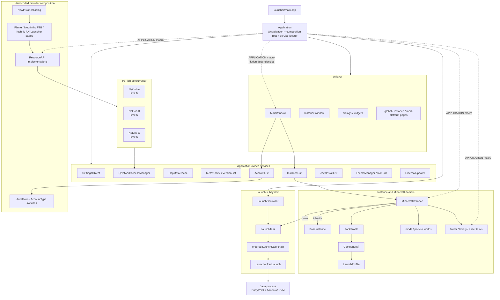
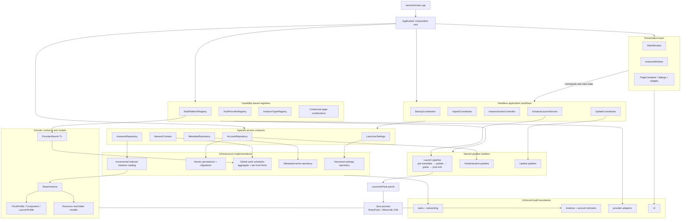
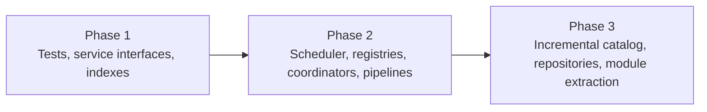

# Architecture diagrams

These diagrams summarize the current architecture and the recommended target architecture. They intentionally omit individual leaf classes so the principal ownership, dependency, and extension boundaries remain visible.

## Before: current architecture

### Current pressure points

- `Application` combines composition, service access, startup, window coordination, and launch coordination.
- UI and domain code obtain dependencies through the global `APPLICATION` macro.
- Providers and account types are constructed through central lists and switches.
- Instance discovery performs full scans and important lookups are linear.
- Each `NetJob` applies its own concurrency limit, so aggregate work is not globally bounded.
- Launch and authentication pipelines are assembled directly in concrete classes.

## After: recommended target architecture

### Target properties

- `Application` remains the composition root but is no longer the dependency API used by domain code.
- Workflows are testable without creating application windows.
- Providers, authentication methods, instance types, and pages register through capability-based descriptors.
- Network work is globally scheduled with provider-aware limits and retry policies.
- The instance catalog uses indexed lookup and incremental filesystem reconciliation.
- Launch, update, and authentication behavior is composed through deterministic named phases.
- Persistence has explicit schemas, atomic writes, and versioned migrations.
- Build targets enforce the intended architectural boundaries.

## Migration direction

